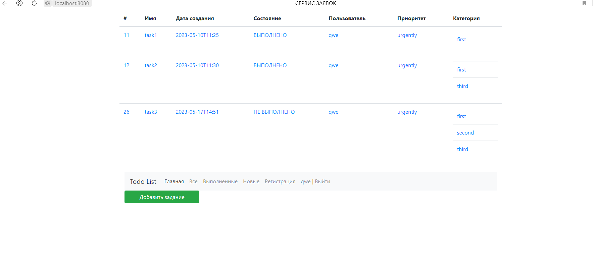
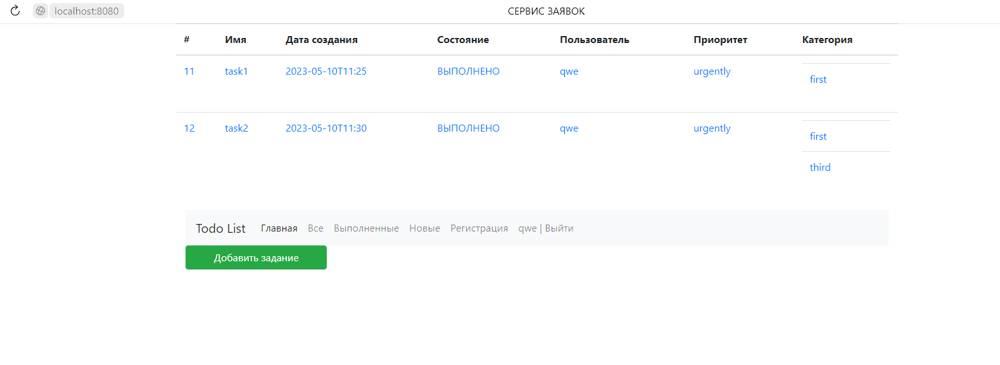
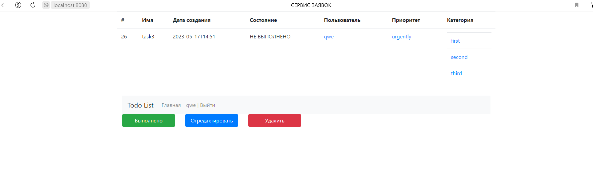

# job4j_todo - Репозиторий Сергея Баранова.

Я прохожу обучение по курсу Job4j.

Ниже находятся наиболее интересные проекты, которые я реализовал во время обучения.

http://job4j.ru/

Цель проекта - освоить Java.

Проект "TODO список".

В данном проекте реализован механизм работы с заданиями.

### Для запуска проекта :

1. Создать БД командой `create database todo;` ;
2. Запустить приложение командой `mvn spring-boot:run;`

Скриншоты  web - интерфейса:

Чтобы выполнить какие - либо действия на сайте, 
необходимо выполнить регистрацию и авторизоваться.

На начальном экране у нас выводится список заявок из БД:

Нажав на кнопки "Все", "Выполненные", "Новые", мы, соответственно, 
можем отобразить список со всеми заявками, только выполненными заявками,
только не выполненными заявками:

Нажав на кнопку "Добавить заявку" мы попадаем в меню добавления новой заявки,
где вводим ее описание и нажимаем "Сохранить":

Кликнув по любой заявке в списке, мы попадаем в меню, где 
можем отредактировать, удалить заявку или перевести ее статус "Выполнено",
нажав на соответствующие кнопки:

При редактировании мы попадаем в отдельное меню:

Где мы можем отредактировать заявку и, нажав на кнопку "Сохранить", -
возвращаемся на начальный экран, где видим список заявок, включающий нашу отредактированную заявку.
При удалении и изменении статуса на "Выполнено", - мы возвращаемся на начальный экран,
где видим список заявок, включающий нашу заявку с измененным статусом, либо список без заявки,
которую мы удалили.
Также ссылка на начальный экран есть во всех подменю.

Стек технологий : Java 14; PostgreSQL 14.

Требования к окружению : Java 17, Maven 3.8, PostgreSQL 14.

Контакты : mariosb84@mail.ru .

